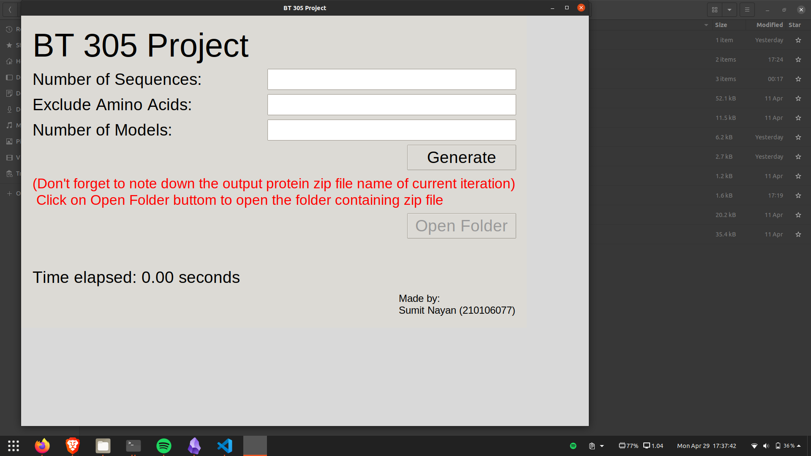
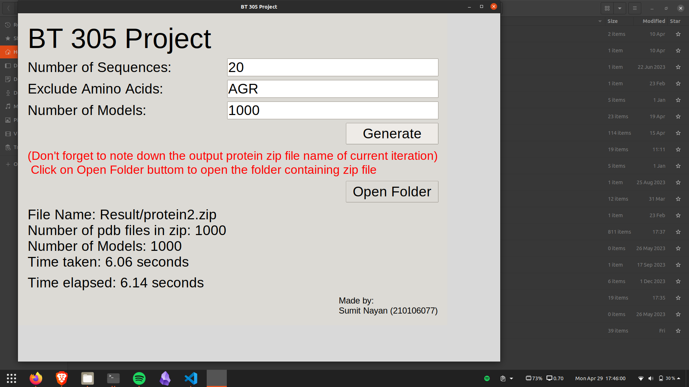

# ProteinCraft

This Python script generates protein data based on random phi and psi angles for amino acids. It includes a Graphical User Interface (GUI) for user interaction.

## Requirements
- **Ubuntu Version** >= 18.04
- **Python Environment**: Ensure Python 3 is installed on your system.
- **Dependencies**: The following Python libraries are required:
  - `tkinter`

## Installation

You can install the required libraries using `pip` with the following command:

```bash
pip install tk
```

## Usage

1. **Clone the repository from GitHub:**

    ```bash
    git clone https://github.com/sumit-nayan/ProteinCraft.git
    ```

2. **Move into the project directory:**

    ```bash
    cd ProteinCraft
    ```
3. **Make Ribosome excutable**

    ```bash
    chmod +x ribosome
    ```
4. **Run the script:**

    ```bash
    python3 main.py
    ```

5. **Enter the desired parameters in the GUI:**
   - Number of sequences
   - Amino acids to exclude
   - Number of models to generate

6. **Click the "Generate" button to initiate the data generation process.**

7. **Once the generation is complete, click the "Open Folder" button to view the generated files.**
## Usage Guide

After running `main.py`, a GUI will appear as shown below:



Enter all necessary values and click on the "Generate" button. The timer will initiate and cease upon completion of file generation. Results will display on the GUI.



Remember the name of the ZIP file generated in the current iteration. Click on "Open Folder" to access the folder containing the protein ZIP file. Extract the ZIP file to find the required PDB file.


## Functionality

- The script generates protein data based on user input for the number of sequences, amino acids to exclude, and the number of models.
- It creates `.rib` files as input for the `ribosome` program and generates corresponding `.pdb` files.
- The GUI provides real-time feedback on the progress and elapsed time.
- Error handling is included for file generation and subprocess calls.
## Made by

- Sumit Nayan (210106077)

## License

This project is licensed under the [License Name] License - see the [LICENSE](LICENSE) file for details.
